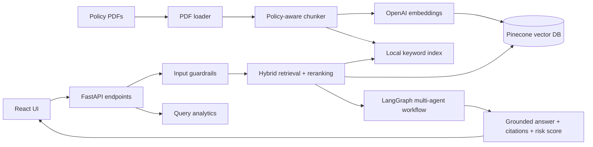

# AI-Powered Policy Compliance Intelligence Assistant

An end-to-end policy compliance assistant built with FastAPI, LangGraph, GPT-4o-mini, Pinecone, and React.

The backend ingests the four policy PDFs in `backend/data/policies`, chunks and embeds them, stores them in Pinecone, then answers employee compliance questions with hybrid retrieval, source citations, multi-agent reasoning, risk scoring, and recommended next steps.

## Architecture



## Prerequisites

- Python 3.11+
- Node.js 20+
- OpenAI API key
- Pinecone API key

## Backend Setup

```powershell
cd backend
python -m venv .venv
.\.venv\Scripts\Activate.ps1
pip install -r requirements.txt
copy .env.example .env
```

Edit `backend/.env`:

```env
OPENAI_API_KEY=your_openai_key
PINECONE_API_KEY=your_pinecone_key
PINECONE_INDEX_NAME=policy-compliance-agent
PINECONE_CLOUD=aws
PINECONE_REGION=us-east-1
LANGSMITH_TRACING=false
LANGSMITH_API_KEY=your_langsmith_key
LANGSMITH_PROJECT=policy-compliance-agent
```

Set `LANGSMITH_TRACING=true` to trace LangGraph and LangChain calls in LangSmith.

Run the API:

```powershell
uvicorn app.main:app --reload --port 8000
```

Ingest the PDFs into Pinecone:

```powershell
Invoke-RestMethod -Method Post http://localhost:8000/api/v1/ingest
```

Ask a compliance question:

```powershell
Invoke-RestMethod -Method Post http://localhost:8000/api/v1/query `
  -ContentType "application/json" `
  -Body '{"question":"Do privileged accounts need multi-factor authentication?","filters":{"category":"Identification and Authentication"}}'
```

## Frontend Setup

```powershell
cd frontend
npm install
npm run dev
```

Open the URL shown by Vite, normally `http://localhost:4173`. The `dev` script builds and serves the React app with Vite preview for a stable local demo.

## Main API Endpoints

- `GET /health` - service health
- `GET /api/v1/policies` - available local policy PDFs
- `POST /api/v1/ingest` - parse, chunk, embed, and upsert policy PDFs to Pinecone
- `POST /api/v1/query` - answer a natural-language compliance question
- `GET /api/v1/analytics` - query volume, common topics, and recent risk events
- `POST /api/v1/evaluate/retrieval` - lightweight retrieval quality check against test cases
- `POST /api/v1/evaluate/llm-judge` - DeepEval LLM-as-judge scoring for answer relevancy, faithfulness, and context quality

## Example Response Shape

The assistant returns:

- `answer`: employee-friendly policy explanation
- `compliance_status`: `compliant`, `non_compliant`, `needs_review`, or `unclear`
- `risk`: level, score, reasoning, and escalation recommendation
- `recommendations`: compliant alternatives or next steps
- `citations`: source policy, page, section, and text excerpt
- `agent_trace`: short outputs from each LangGraph agent
- `context_precision`: share of retrieved policy passages that were relevant enough to support the generated answer

## Design Choices

- **Pinecone** is used as the production vector database because it is managed, fast, and supports metadata filtering for policy categories and frameworks.
- **Hybrid retrieval** combines Pinecone semantic search with local keyword scoring. Compliance language is exacting, so keyword matches for terms like "multi-factor", "incident", or "authorization" should still influence ranking.
- **Policy-aware chunking** keeps chunks near 900 tokens with overlap and carries metadata such as policy name, page, category, framework, and detected section heading.
- **LangGraph orchestration** makes the multi-agent pipeline explicit: retrieval, interpretation, compliance checking, risk assessment, and recommendations each produce structured intermediate state.
- **Guardrails** reject empty, hostile, or non-policy queries and force the final answer to cite retrieved sources.

## Evaluation

Run the API, ingest documents, then call:

```powershell
Invoke-RestMethod -Method Post http://localhost:8000/api/v1/evaluate/retrieval `
  -ContentType "application/json" `
  -Body '{"cases":[{"question":"When should access be revoked?","expected_terms":["access","terminate","authorization"]}]}'
```

The repository includes a lightweight evaluator. `deepeval` is listed as an optional dependency for teams that want to add LLM-as-judge regression tests.

DeepEval LLM-as-judge example:

```powershell
Invoke-RestMethod -Method Post http://localhost:8000/api/v1/evaluate/llm-judge `
  -ContentType "application/json" `
  -Body '{"question":"Do privileged user accounts need multi-factor authentication?","generate_answer":true,"filters":{"category":"Identification and Authentication"},"metrics":["answer_relevancy","faithfulness","contextual_relevancy","contextual_precision"],"expected_output":"Privileged access should use strong authentication controls such as MFA when required by policy.","threshold":0.7}'
```

If `actual_output` is not provided and `generate_answer` is true, the backend first runs the normal compliance agent workflow, then asks DeepEval to judge the generated answer against retrieved policy context. Metrics that require missing inputs are skipped with an explanation.
